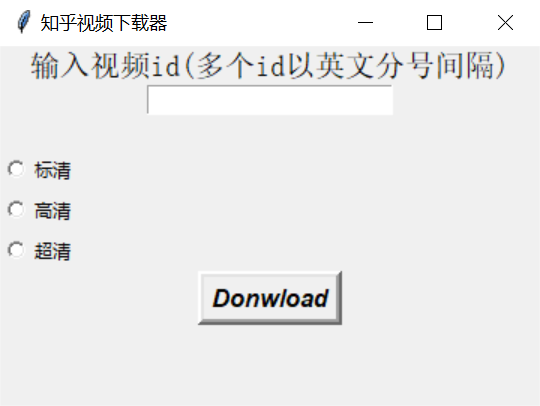
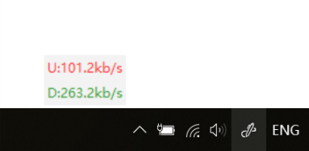
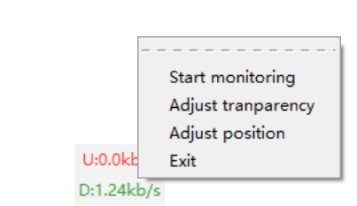
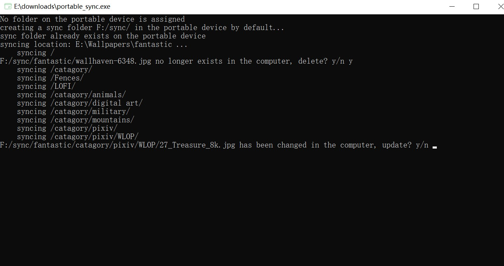
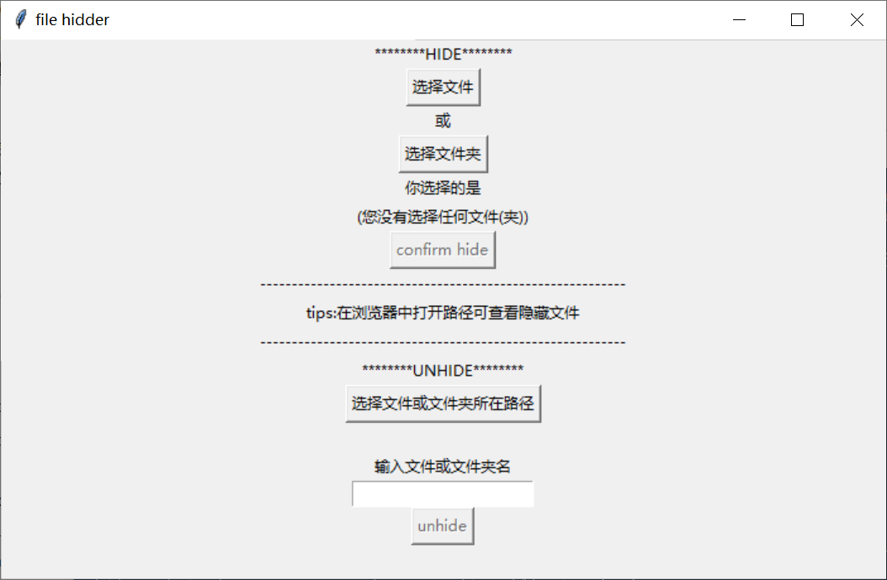
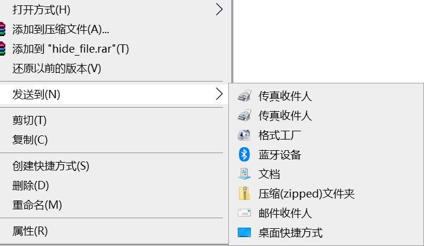

# Python-tools
Useful tools implemented with Python in 200 lines or less.

### [English version](./README.md)

这个 repository 收集了我从 2018 年开始用 Python 以来，写的一些小工具，涵盖了爬虫、系统操作等方面。你可以使用这些工具来解决一些问题，提高生产效率；或者，也可以将它们作为小项目练习 Python 这门语言~

我编写的这些工具都比较轻量级，只有一个 Python 文件，**100行**左右的代码，并且只调用了很少的第三方库或者只需要内置库就OK。这些工具涉及到的方面很多，包括建立爬虫的**免费IP池**:globe_with_meridians:，**刷网页浏览量**:eyeglasses:，**爬取知乎答案**:book:，**下载知乎视频**:beginner:；**屏幕录制**:movie_camera:，**网速监测**:satellite:工具，**文件隐藏**:books:，文件**同步工具**:file_folder:等等。希望你能从中找到自己喜欢的:heart:

如果你有新的想法，或者对代码的优化，欢迎提 issues 或者 pull request ！

(PS: *每个工具的用法都写在了对应的.py文件中，部分工具我生成了exe文件可以直接运行*)

### 屏幕录制工具:movie_camera: -- [simple-screen-recorder](simple_screen_recorder.py)

> Record the computer screen using python and ffmpeg. (图形操作界面)

功能：

- 选择保存位置，选择录制**帧数**和**分辨率**
- 设置自动保存，下次打开时会自动加载上次的设置
- 开始录制之前会有3秒提示
- 结束录制按下F10即可

<div align="center">

</div>

（[点此下载](https://github.com/wolverinn/Python-tools/releases/tag/v1.0)可执行exe文件）

### 知乎视频下载器:beginner: -- [zhihu-video-downloader](zhihu_video_downloader.py)

> Download videos from zhihu.com using python3 and ffmpeg. (图形操作界面)

通过知乎视频id下载视频到当前目录，可一次性添加多个id下载。视频id就是知乎视频链接末尾的数字，在知乎收藏夹中打开带有视频的回答，便可找到视频id

<div align="center">

</div>

（[点此下载](https://github.com/wolverinn/Python-tools/releases/tag/v1.0)可执行exe文件）

### 建立免费IP池:globe_with_meridians: -- [free-ip-pool](free_ip_pool.py)

> Self-made ip pool stored in SQLite3, crawling free proxies from websites that offer them.

功能：

- 从3个提供免费高匿IP的网站上，爬取IP保存到SQLite3数据库中，构建IP池
- 测试数据库中IP的有效性，删除失效的IP

### 网速实时监测:satellite: -- [simple-net-speed-monitor](net_speed_monitor.pyw)

> A simple net speed monitor using python3 tkinter library. (图形界面)

一个简洁的网速监视器，实时显示计算机上传和下载速度。

<div align="center">

</div>

右键菜单支持更多功能:

- 调整位置 Adjust position ：可按键调整，也可输入坐标调整。调整完后选择保存则下次自动应用新位置
- 调整透明度 Adjust transparency ：新的设置会保存，下次自动加载
- 重启监测：若关闭调整窗口后（由于直接关闭了调整窗口而不是点击“save”）发现监测停止，可右键“Start monitoring”或者直接双击，就可开始监测
- 退出程序

<div align="center">

</div>

（[点此下载](https://github.com/wolverinn/Python-tools/releases/tag/v1.1)可执行exe文件）

### 刷网页浏览量:eyeglasses:

输入一个URL，程序会不断访问，来增加这个网页的访问量。使用 selenium 实现。可以用在博客文章刷阅读量

- 按浏览次数刷：[power-views](power_views.py)

实现方式是通过隐身模式不断访问网页，这种方式只能增加浏览次数，但是网站不会增加浏览的人数

- 按浏览人数刷：[ip-pool-browse](ip_pool_browse.py)

通过上面提到的IP池实现，每次都用不同的IP访问网页，网站会计数为不同的人。

### 文件同步工具:file_folder: -- [portable-sync](portable_sync.py)

> A tool to sync the files in the computer to the portable devices, including auto-update and deletion.

这是一个小巧的同步工具，可以自动将电脑上的文件夹同步到移动设备（U盘/移动硬盘...）上。可以自定义想要同步的文件夹（可以选多个），对不想同步的文件后缀会自动屏蔽，还可以选择当文件发生更新或删除时如何处理。

之所以写这样一个同步工具，是因为个人觉得将东西同步在云盘上其实是一个很脆弱的做法，就算是自己搭建的云盘，也说不准就崩了，觉得最稳妥的还是同步到自己的移动硬盘或者U盘。然后试了试，发现Windows复制文件夹的时候，首先不会检测文件是否有变化，要么跳过，要么选择替换，效率很低，而且多余的文件不会删除，相当于是合并，这显然和同步的要求相去甚远，所以只好自己写一个简单的同步的 Python 工具。既可以方便快速地访问，又保证了一定的个人信息安全。

<div align="center">

</div>

### 文件隐藏小工具:books: -- [hide-file](hide_file.py)

隐藏Windows文件系统（Linux没试过）下的文件或者文件夹，以一种极简的方式达到保护文件的目的。

其他人使用文件资源管理器打开文件所在目录的时候，无法看到该文件。就算设置了“显示隐藏的文件（夹）”也看不到。在命令行中使用```dir```或者```ls```命令也看不到。对于一般需求的文件保护来说足够了。

<div align="center">

</div>

### 爬取知乎回答并生成词云图:book: -- [zhihu-answer-wordcloud](zhihu_answer_wordcloud.py)

首先实现了批量爬取知乎某个问题下的答案，并以markdown形式保存到本地。

之后再对markdown文件中的内容进行分析，使用了中文分词工具和词云图第三方库，生成某一问题下的热门答案的词云图。

### 修改右键“发送到”菜单 -- [send-to-editor](send_to_editor.py)

既可以删除“发送到”菜单中你不想要的内容，也可以往里面添加路径，或者添加某个应用程序，实现用此应用程序打开。

<div align="center">

</div>

### 一键获取Windows聚焦的图片 -- [windows-focus](windows_focus.py)

Windows聚焦的图片比较漂亮，会经常在电脑上更新。但是，保存Windows聚焦的图片是一件很麻烦的事情：

- Windows聚焦的图片存储路径太复杂，必须记在记事本上，用的时候复制粘贴一遍；
- 进入了图片的存储路径之后，会发现全都是没有后缀名的文件，必须手动添加```.jpg```的后缀才能得到图片；
- 变成图片格式之后，才会发现很多图片其实只是某一张完整图片的一个部分，比如```488x216```这种大小，找了好久才找到真正要的那张

这个小工具可以直接扫描该路径，剔除掉那些并不完整的图，把其它图片保存到当前目录，非常省心。

### Show off in front of your classmates -- [pocketuni-crack](pocketuni_crack.zip)

> 这是一个爬虫工具，但和一般的Python爬虫不同，它可以让你小小地在同学面前装个逼。当然，前提是如果你在上学的某个时候，需要用到 pocketuni 这个平台，给一些活动投票什么的。你可以用这个工具在上面大量注册一些用户，从而实现刷票。

### 将网页文章保存为markdown -- [web2md](web2md.py)

本质上是调用了一个第三方库的功能，将网页保存为markdown，适合用在比较简洁的网页，比如一些文章，像微信公众号的文章什么的。复杂一些的网页就不能保证保存下来的markdown的排版了。将网页保存为markdown而不是PDF的好处就是体积小，而且修改更加方便。

### Run any py -- [run_any_py](run_any_py.py)

如果一个目录下面有很多 Python 文件，打开命令行再输入```python xxx.py```有些麻烦。而这个工具会一直开启，只需要输入一个数字就可以运行对应的 Python 文件了。

### 取一个地道英文名 -- [ename](ename.py)

输入中文名和性别，得到一个地道的英文名。其实就是调用了扇贝网的接口。

### 获取随机的UserAgent -- [random-userAgents](random_userAgents.py)

里面收集了很多不同的 UserAgent ，爬虫的时候可以用到，获取一个随机的 UserAgent .

*Inspired by [GitHub - geekcomputers/Python: My Python Examples](https://github.com/geekcomputers/Python)*
